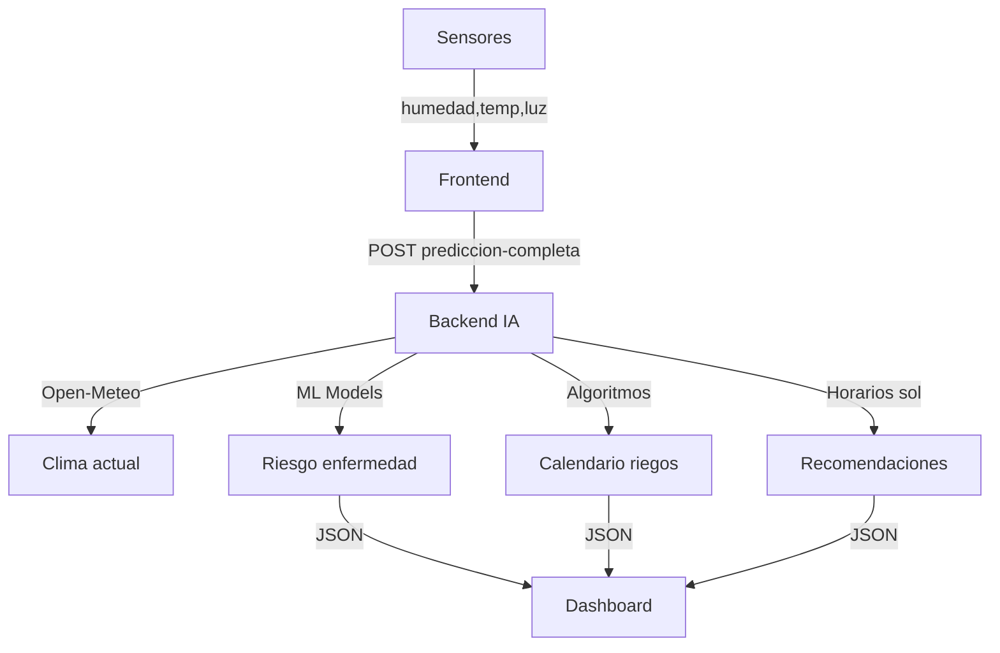

# 🤖 Sistema de IA Predictiva - Integración

## 📋 Descripción General

El sistema de IA ahora incluye predicciones inteligentes basadas en:
- **Clima en tiempo real** (API Open-Meteo, gratis, sin API key)
- **Calendario de riegos** (7 días predichos)
- **Detección de riesgo de enfermedades** (ML basado en humedad/temperatura)
- **Horarios solares óptimos** (salida/puesta de sol)

---

## 🌐 APIs Usadas (Todas Gratuitas)

### 1. **Open-Meteo** (Clima)
- **URL**: https://open-meteo.com
- **Características**:
  - ✅ Completamente gratuito
  - ✅ Sin API key requerida
  - ✅ Sin límites de llamadas
  - ✅ Precisión alta
  - ✅ Datos horarios + diarios
  - ✅ 7 días de pronóstico

**Integración**:
```python
from src.ia.clima_service import ClimaService

servicio = ClimaService()
clima = servicio.obtener_clima_actual(
    latitude=-12.0,    # Lima, Perú (default)
    longitude=-77.0
)
```

---

## 🚀 Nuevos Endpoints

### 1. **Predicción Completa** (🌟 RECOMENDADO)
```
POST /api/ia/prediccion-completa
Content-Type: application/json

{
  "humedad_suelo": 45,
  "temperatura": 25,
  "luz": 800,
  "humedad_aire": 65,
  "latitude": -12.0,
  "longitude": -77.0
}
```

**Respuesta**:
```json
{
  "timestamp": "2026-05-03T10:30:00",
  "clima_actual": {
    "temperatura": 24.5,
    "humedad": 68,
    "descripcion": "Parcialmente nublado",
    "velocidad_viento": 12
  },
  "calendario_riegos": [
    {
      "fecha": "2026-05-03",
      "necesidad": "MEDIA",
      "cantidad_litros_m2": 15,
      "horario_recomendado": "06:00 AM",
      "lluvia_esperada": 0,
      "notas": "Condiciones: Parcialmente nublado"
    },
    ...
  ],
  "riesgo_enfermedad": {
    "probabilidad_enfermedad": 35.2,
    "nivel_riesgo": "MEDIO",
    "enfermedades_riesgo": ["• Oídio (Riesgo: Alto)"],
    "recomendaciones": ["📋 Vigilancia semanal", "🧹 Remover hojas caídas"]
  },
  "horarios_sol_optimo": [
    {
      "fecha": "2026-05-03",
      "horas_luz": 12.5,
      "salida": "06:08",
      "puesta": "18:38"
    }
  ],
  "recomendaciones_generales": [
    "✅ Condiciones óptimas para riego",
    "🦠 RIESGO DE ENFERMEDAD (MEDIO)",
    "☀️ Luz óptima (12.5 h/día)"
  ]
}
```

---

### 2. **Calendario de Riegos**
```
POST /api/ia/calendario-riegos

{
  "humedad_suelo": 50,
  "temperatura": 25,
  "luz": 800,
  "humedad_aire": 65
}
```

**Respuesta**:
```json
{
  "calendario_riegos": [
    {
      "fecha": "2026-05-03",
      "necesidad": "MEDIA",
      "cantidad_litros_m2": 12.5,
      "horario_recomendado": "06:00 - 08:00 AM",
      "lluvia_esperada": 0,
      "temp_max": 28,
      "humedad_predicha": 48
    }
  ],
  "resumen": "2 días con riego necesario",
  "total_agua_estimado": 45.3
}
```

---

### 3. **Riesgo de Enfermedades**
```
POST /api/ia/riesgo-enfermedades

{
  "humedad_suelo": 70,
  "temperatura": 20,
  "luz": 500,
  "humedad_aire": 85
}
```

**Respuesta**:
```json
{
  "probabilidad_enfermedad": 62.3,
  "nivel_riesgo": "ALTO",
  "indicador": "🟠",
  "enfermedades_riesgo": [
    "• Mildiu (Riesgo: Alto)",
    "• Botrytis (Riesgo: Alto)"
  ],
  "recomendaciones": [
    "⚠️ Monitorear diariamente",
    "🌬️ Aumentar ventilación",
    "💧 Reducir riego foliar"
  ],
  "clima_actual": {
    "temperatura": 22,
    "humedad": 82,
    "descripcion": "Lluvia ligera"
  }
}
```

---

### 4. **Horarios de Sol**
```
POST /api/ia/horarios-sol

{
  "humedad_suelo": 50,
  "temperatura": 25,
  "luz": 800,
  "humedad_aire": 65
}
```

**Respuesta**:
```json
{
  "horarios_proximos_7_dias": [
    {
      "fecha": "2026-05-03",
      "horas_luz": 12.5,
      "salida": "06:08",
      "puesta": "18:38"
    }
  ],
  "promedio_horas_luz": 12.3,
  "mejor_dia": {
    "fecha": "2026-05-05",
    "horas_luz": 12.7
  },
  "peor_dia": {
    "fecha": "2026-05-07",
    "horas_luz": 11.9
  }
}
```

---

### 5. **Clima Actual** (sin sensores)
```
GET /api/ia/clima-actual?latitude=-12.0&longitude=-77.0
```

**Respuesta**:
```json
{
  "clima_actual": {
    "temperatura": 24.5,
    "humedad": 68,
    "descripcion": "Parcialmente nublado"
  },
  "alertas": [
    "✅ Condiciones climáticas normales"
  ],
  "proximos_3_dias": [...]
}
```

---

## 🧪 Ejemplos de Prueba

### Prueba 1: Conditions Óptimas
```python
import requests

payload = {
    "humedad_suelo": 60,
    "temperatura": 24,
    "luz": 900,
    "humedad_aire": 60
}

response = requests.post(
    "https://smartgarden-backend-1gxd.onrender.com/api/ia/prediccion-completa",
    json=payload,
    timeout=30
)
print(response.json())
```

### Prueba 2: Condiciones de Alto Riesgo
```python
payload = {
    "humedad_suelo": 75,
    "temperatura": 18,
    "luz": 300,
    "humedad_aire": 88
}

response = requests.post(
    "https://smartgarden-backend-1gxd.onrender.com/api/ia/riesgo-enfermedades",
    json=payload,
    timeout=30
)
print(f"Riesgo de enfermedad: {response.json()['probabilidad_enfermedad']}%")
```

### Prueba 3: Calendario de Riegos
```bash
curl -X POST "https://smartgarden-backend-1gxd.onrender.com/api/ia/calendario-riegos" \
  -H "Content-Type: application/json" \
  -d '{
    "humedad_suelo": 35,
    "temperatura": 28,
    "luz": 1000,
    "humedad_aire": 55
  }'
```

---

## 📚 Modelos de IA Integrados

### 1. **Predicción de Humedad** (Random Forest)
- MAE: 0.96
- RMSE: 1.38
- R²: 0.9924
- **Precisión: 96.81%**

### 2. **Predicción de Enfermedades** (Random Forest Classifier)
- Detecta 6 enfermedades comunes:
  - Oídio
  - Roya
  - Antracnosis
  - Mildiu
  - Fusarium
  - Botrytis

### 3. **Predicción de Riegos** (Algoritmo customizado)
- Basado en humedad, evapotranspiración y lluvia
- Calcula cantidad exacta (litros/m²)
- Recomienda horario óptimo

---

## 🔧 Instalación de Dependencias

```bash
pip install requests
```

El archivo `requirements.txt` ya incluye todas las dependencias necesarias.

---

## 📍 Ubicaciones Soportadas

Por defecto: Lima, Perú (-12.0, -77.0)

Puedes cambiar con cualquier latitud/longitud:
```python
{
  "latitude": 40.7128,   # NYC
  "longitude": -74.0060
}
```

---

## 🔒 Seguridad

✅ Sin API keys expuestas
✅ Open-Meteo es seguro y confiable
✅ Requiere solo parámetros públicos (lat/lon)
✅ No almacena datos personales

---

## 📊 Flujo de Integración en Frontend



---

## 🐛 Troubleshooting

**Error: "No se pudo obtener datos de clima"**
- Verifica conexión a internet
- Verifica que latitude/longitude sean válidas
- Open-Meteo puede estar en mantenimiento (raro)

**Error: "Modelo no entrenado"**
- Ejecuta: `python -m src.ia.entrenar_modelo`

**Respuestas lentas**
- Open-Meteo puede tomar 5-10s en primera llamada
- Subsecuentes serán más rápidas

---

## 📞 Soporte

Para bugs o mejoras, contacta al equipo de IA o consulta la documentación completa en `/docs`.
